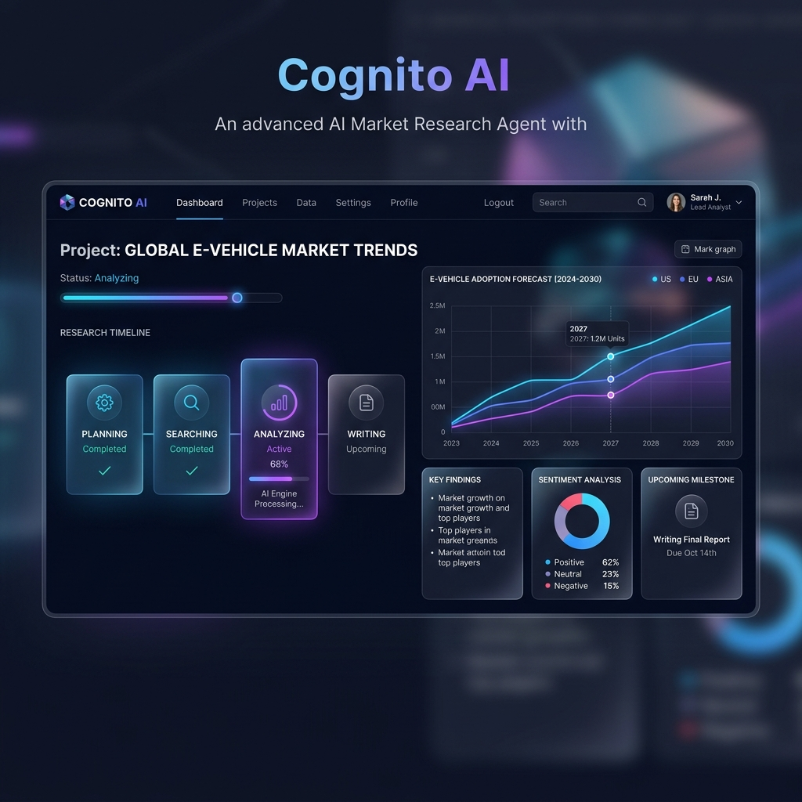

# 🚀 Market Research Agent

**Live Demo:** [https://market-research-agent-jsr2406.vercel.app](https://market-research-agent-jsr2406.vercel.app)

A hyper-modern, full-stack AI orchestration platform that performs deep-dive market research in real-time. Built with **Next.js 15**, **FastAPI**, and **OpenRouter AI**, it utilizes a multi-agent system to plan, research, analyze, and generate professional reports.




## ✨ Features

- **🤖 Multi-Agent Orchestration**: Specialized agents for Planning, Researching, Analyzing, Opportunity Discovery, Writing, and Editing.
- **⚡ Real-time Updates**: Live WebSocket streaming shows the agent's progress step-by-step.
- **🎨 Premium UI/UX**: Built with Tailwind CSS and Framer Motion for a smooth, glassmorphic design.
- **🔍 Deep Analysis**: Leverages state-of-the-art LLMs (via OpenRouter) to provide actionable market insights.
- **📄 Professional Reports**: Generates comprehensive reports with structured findings and strategic recommendations.

## 🛠️ Tech Stack

- **Frontend**: Next.js 15 (App Router), TypeScript, Tailwind CSS, Framer Motion, Lucide React.
- **Backend**: FastAPI (Python), WebSockets, HTTPX, Pydantic.
- **AI Engine**: OpenRouter API (Nemotron models).
- **Communication**: Real-time bidirectional WebSockets.

## 📂 Project Structure

```text
market-research-agent/
├── backend/            # FastAPI WebSocket Server
│   ├── agents/         # Agent logic (Planner, Research, Analyst, etc.)
│   ├── api/            # WebSocket endpoints
│   └── core/           # LLM client & configuration
├── frontend/           # Next.js 15 Application
│   ├── app/            # App Router pages
│   └── components/     # UI components (Timeline, Input, Viewer)
└── assets/             # Project media & screenshots
```

## 🚀 Getting Started

### 1. Prerequisites

- Python 3.9+
- Node.js 18+
- OpenRouter API Key

### 2. Backend Setup

1. **Navigate to the root directory.**
2. **Create and activate a virtual environment:**
   ```bash
   python -m venv backend/.venv
   # Windows
   .\backend\.venv\Scripts\activate
   # Linux/macOS
   source backend/.venv/bin/activate
   ```
3. **Install dependencies:**
   ```bash
   pip install -r backend/requirements.txt
   ```
4. **Configure Environment Variables:**
   Create a `backend/.env` file:
   ```env
   OPENROUTER_API_KEY=your_key_here
   ```
5. **Run the server:**
   ```bash
   uvicorn backend.main:app --reload --port 8000
   ```

### 3. Frontend Setup

1. **Navigate to the `frontend` directory:**
   ```bash
   cd frontend
   ```
2. **Install dependencies:**
   ```bash
   npm install
   ```
3. **Run the development server:**
   ```bash
   npm run dev
   ```
4. **Open your browser:** Go to `http://localhost:3000`.

## 🧠 Agentic Workflow

1. **Planner**: Breaks down the research topic into logical steps.
2. **Researcher**: Gathers real-time data and market trends.
3. **Analyst**: Processes the raw data into meaningful insights.
4. **Opportunity Agent**: Identifies gaps and potential market entries.
5. **Writer**: Drafts the initial comprehensive report.
6. **Editor**: Polishes the report for professional quality and formatting.

## 📄 License

This project is open-source and available under the [MIT License](LICENSE).

---

Built with ❤️ by [Janmejay Singh](https://github.com/JSR2406)
